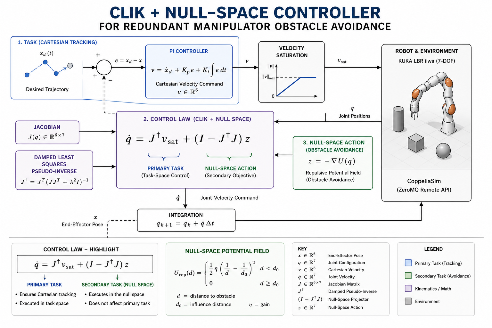

# 🤖 KUKA LBR iiwa – Null-Space Obstacle Avoidance


## 🧠 Overview

This project focuses on controlling a **7-DOF redundant manipulator (KUKA LBR iiwa)** to track Cartesian trajectories while avoiding obstacles in real time.

The main idea is simple but powerful:
- Use **CLIK (Closed-Loop Inverse Kinematics)** for tracking  
- Exploit **redundancy** to handle obstacle avoidance in the null space  

The system is implemented in **MATLAB** and simulated in **CoppeliaSim** via the **ZeroMQ Remote API**.

---



## ⚙️ How it works (intuition first)

Check the diagram above 👆

Pipeline:
1. A Cartesian trajectory is defined  
2. A PI controller generates desired velocity  
3. CLIK maps it to joint velocities  
4. A secondary objective handles obstacle avoidance  

👉 Key idea:  
**Obstacle avoidance is handled in the null space**, so it does not interfere with the main tracking task.

---

## 🧮 Control Law

\[
\dot{q} = J^\dagger v + (I - J^\dagger J) z
\]

- First term → tracking  
- Second term → null-space action (avoidance)

---

## 🎯 Primary Task — Tracking

- Cartesian PI controller  
- Waypoint tracking  
- Velocity saturation  

---

## 🚧 Secondary Task — Obstacle Avoidance

### Potential Fields (Khatib)
- Repulsive action from obstacles  

### Vortex Component
- Adds tangential motion  
- Prevents local minima  

---


## 🛡️ Robustness Strategies

- **Damped Least Squares** → stable near singularities  
- **Task relaxation** → reduces tracking priority near obstacles  
- **Anti-stall mechanism** → helps escape stuck situations  

---

## 📊 Results

- Stable tracking  
- No collisions  
- Smooth motion  

Metrics:
- Cartesian error  
- Minimum distance  
- Joint velocities  

---

## ▶️ How to Run

### 1. MATLAB setup
```matlab
addpath('src')
```

### 2. Open CoppeliaSim
Load:
```
sim/kuka_scene.ttt
```

⚠️ Do NOT press Play manually.

### 3. Run
```matlab
run('src/main_avoidance.m')
```

---

## 📂 Repository Structure

```text
KUKA-iiwa-Obstacle-Avoidance/
├── src/                      # MATLAB source code (core logic)
│   ├── main_avoidance.m      # Main script: runs simulation and control loop
│   ├── controller_nullspace.m # Implements CLIK + null-space control law
│   ├── RemoteAPIClient.m     # Interface with CoppeliaSim (ZeroMQ)
│   └── cbor.m                # Serialization utility for communication
│
├── model/                    # Robot model definition
│   ├── kukanomesh.urdf       # URDF used in MATLAB
│   └── meshes/               # STL mesh files for visualization
│
├── sim/                      # Simulation environment
│   └── kuka_scene.ttt        # CoppeliaSim scene (robot + obstacles)
│
├── control_scheme.png        # Controller block diagram (this README)
├── kuka_avoidance.gif        # Demo of the robot behavior
├── README.md                 # Documentation
└── LICENSE                   # MIT License
```

---


## 👤 Author

Giorgio De Santis  
MSc AI & Robotics  

---

## 📄 License

MIT License
