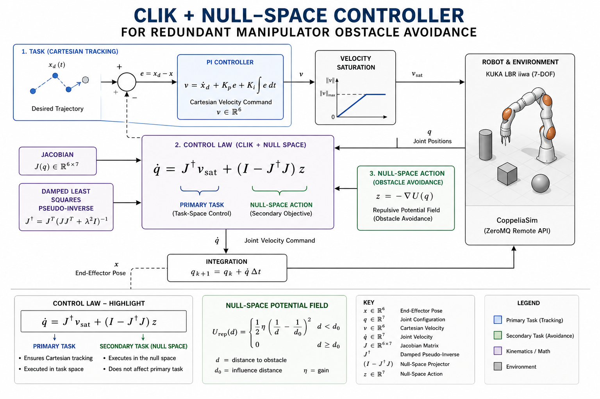

# KUKA LBR iiwa — Null-Space Obstacle Avoidance


A 7-joint arm asked to put its end-effector somewhere has more ways to do it than it
needs. This project spends the surplus on staying out of the way: the end-effector keeps
tracking its target while the elbow and forearm reconfigure themselves around obstacles,
and the two behaviours do not fight each other, because the avoidance motion is confined
to the directions in which the end-effector does not move at all.

Written in MATLAB, simulated in CoppeliaSim over the ZeroMQ remote API.



---

## 📖 Theory

### Redundancy

The LBR iiwa has $n = 7$ revolute joints. The primary task here is **position only** — put
the end-effector at a point, with its orientation left free — so the task space is
$m = 3$ dimensional and the degree of redundancy is

$$r = n - m = 7 - 3 = 4$$

Four dimensions of joint motion that leave the end-effector exactly where it is. That is
the budget the obstacle avoidance gets to spend.

### Differential kinematics

Joint velocities map to end-effector velocity through the Jacobian $J(q)$:

$$\dot{x} = J(q)\dot{q}$$

with $\dot{q} \in \mathbb{R}^{7}$ and, for a position task, $\dot{x} \in \mathbb{R}^{3}$.
Inverting a $3 \times 7$ matrix means choosing among infinitely many solutions, and the
Moore–Penrose pseudo-inverse $J^{\dagger}$ picks the one of least norm.

Near a singularity that solution is badly behaved: $J^{\dagger}$ blows up and asks for
joint velocities no real arm can deliver. The implementation therefore uses **damped least
squares** instead,

$$J^{\dagger}_{\lambda} = J^{T}\left(JJ^{T} + \lambda^{2} I\right)^{-1}$$

which trades a little tracking accuracy for a bounded solution everywhere. Here
$\lambda = 0.05$.

### The null-space projector

Closing the loop on the measured end-effector position rather than integrating a plan
open-loop — **CLIK**, closed-loop inverse kinematics — keeps the drift from accumulating.
The full control law then adds a second term that the end-effector cannot feel:

$$\dot{q} = J^{\dagger}_{\lambda}\dot{x}_{d} + \left(I - J^{\dagger}_{\lambda}J\right)\dot{q}_{0}$$

| Term | What it does |
|---|---|
| $\dot{x}_{d}$ | desired end-effector velocity, from the position error |
| $`J^{\dagger}_{\lambda}\dot{x}_{d}`$ | least-norm joint motion that achieves it |
| $I - J^{\dagger}_{\lambda}J$ | projector onto the null space of $J$ |
| $\dot{q}_{0}$ | whatever the secondary task wants |

The projector is what makes the scheme work. Any vector it returns produces
$\dot{x} = 0$ at the end-effector, so $\dot{q}_{0}$ can be as aggressive as it likes
without disturbing the primary task — only its component along the four redundant
directions survives.

### Repulsive potential

Let $\rho(q)$ be the distance from a point on the arm to an obstacle, and $\rho_{0}$ the
radius inside which the obstacle is felt at all (the block diagram above labels these
$d$ and $d_{0}$). The repulsive potential is the standard Khatib form:

$$
U_{rep}(q) =
\begin{cases}
\dfrac{1}{2}\eta\left(\dfrac{1}{\rho(q)} - \dfrac{1}{\rho_{0}}\right)^{2} & \rho(q) \leq \rho_{0} \\
0 & \rho(q) \gt \rho_{0}
\end{cases}
$$

It is zero at the boundary and rises without bound at contact. Its negative gradient is the
repulsive force:

$$
F_{rep} =
\begin{cases}
\eta\left(\dfrac{1}{\rho(q)} - \dfrac{1}{\rho_{0}}\right)\dfrac{1}{\rho^{2}(q)}\nabla\rho(q) & \rho(q) \leq \rho_{0} \\
0 & \rho(q) \gt \rho_{0}
\end{cases}
$$

Six points on the arm are watched, not just the end-effector — `link4_resp` through
`link8_resp` and the tool itself — so the elbow cannot quietly swing into something while
the tip stays clear.

### A vortex term, because pure repulsion gets stuck

Pure gradient descent on a potential field has a well-known failure: when the obstacle sits
directly between the arm and its goal, attraction and repulsion cancel and the arm stalls
in a local minimum, pushing straight into a wall that pushes straight back.

The fix is to add a force with no radial component at all — a circulation around the
obstacle:

$$F_{vortex} = \kappa\left(\hat{z} \times \hat{\rho}\right)$$

where $\hat{\rho}$ is the unit vector from obstacle to control point. It neither approaches
nor retreats; it slides sideways, and that is enough to break the symmetry that traps the
purely repulsive field. Here $\kappa = 0.5\eta$.

### From force to joint velocity

Cartesian forces at a control point become joint velocities through the transpose of that
point's own Jacobian — not the end-effector's:

$$\dot{q}_{0} = \sum_{i} J_{i}^{T}\left(F_{rep,i} + F_{vortex,i}\right)$$

The transpose rather than the inverse is deliberate. It is the virtual-work mapping from
force to torque, it needs no matrix inversion, and it degrades gracefully when the control
point is itself near a singular configuration.

### Task relaxation

One more term, and it is the one that turns a demonstration into something that survives
contact with a real scene. Tracking and avoidance can still conflict: if the goal is
*behind* the obstacle, an arm that insists on full tracking speed will press against the
repulsive field indefinitely.

So the primary task is faded out as the arm closes on an obstacle:

$$\dot{x}_{d} \leftarrow \alpha\left(d_{\min}\right)\dot{x}_{d}$$

where $d_{\min}$ is the smallest distance between any watched point and any obstacle, and

$$
\alpha =
\begin{cases}
0.1 & d_{\min} \lt \rho_{c} \\
\dfrac{d_{\min} - \rho_{c}}{\rho_{0} - \rho_{c}} & \rho_{c} \leq d_{\min} \leq \rho_{0} \\
1 & d_{\min} \gt \rho_{0}
\end{cases}
$$

Between $\rho_{c} = 0.15$ m and $\rho_{0} = 0.45$ m the tracking authority ramps down
linearly. It never reaches zero — the floor is $0.1$ — so the arm keeps creeping toward
its goal rather than freezing, but avoidance wins the argument when it matters.

---

## ⚙️ Implementation

| Parameter | Symbol | Value |
|---|---|---|
| Proportional gain | $K_{p}$ | 10.0 |
| Repulsion gain | $\eta$ | 30.0 |
| Damping factor | $\lambda$ | 0.05 |
| Influence radius | $\rho_{0}$ | 0.45 m |
| Critical distance | $\rho_{c}$ | 0.15 m |
| Control period | $T_{s}$ | 0.02 s (50 Hz) |
| Waypoint tolerance | — | 0.03 m |
| Joint velocity limit | $v_{\max}$ | 1.2 rad/s |
| Null-space velocity limit | — | 2.0 rad/s |

Two further details worth knowing:

**Saturation is applied twice.** The null-space term is capped at 2.0 rad/s on its own
before being added, then the total $\dot{q}$ is capped at 1.2 rad/s. Capping only the sum
would let a violent avoidance transient swamp the tracking term instead of both being
scaled down together.

**There is an anti-stall integrator.** If the distance to the target changes by less than
2 mm for 0.4 s, an integral term starts accumulating and pushes the end-effector out of
the deadlock; it is capped at 1.5 and decays by 10% per step once the arm is moving again.
It is not a standard PI controller — the integral is off until the arm is actually stuck,
which keeps it from winding up during normal tracking.

The simulation runs four waypoints in a loop, twice, and plots position error, minimum
robot-obstacle distance and all seven joint velocities against time.

---

## ▶️ Running it

Requires MATLAB with the Robotics System Toolbox, and CoppeliaSim with the ZeroMQ remote
API enabled.

```bash
git clone https://github.com/giorgio0420/KUKA-iiwa-Obstacle-Avoidance.git
cd KUKA-iiwa-Obstacle-Avoidance
```

Open `sim/kuka_scene.ttt` in CoppeliaSim and leave it loaded — **do not press Play**, the
script starts and steps the simulation itself. Then, in MATLAB:

```matlab
addpath('src')
run('src/main_avoidance.m')
```

---

## 📂 Layout

```text
src/
  main_avoidance.m         simulation loop, PI tracking, telemetry and plots
  controller_nullspace.m   the control law above
  RemoteAPIClient.m        CoppeliaSim ZeroMQ interface
  cbor.m                   serialisation helper
model/
  kukanomesh.urdf          robot model used by MATLAB
  meshes/                  collision meshes
sim/
  kuka_scene.ttt           CoppeliaSim scene: robot, obstacles, waypoints
control_scheme.png         controller block diagram
kuka_avoidance.gif         demo
```

## License

MIT — see [LICENSE](LICENSE).
